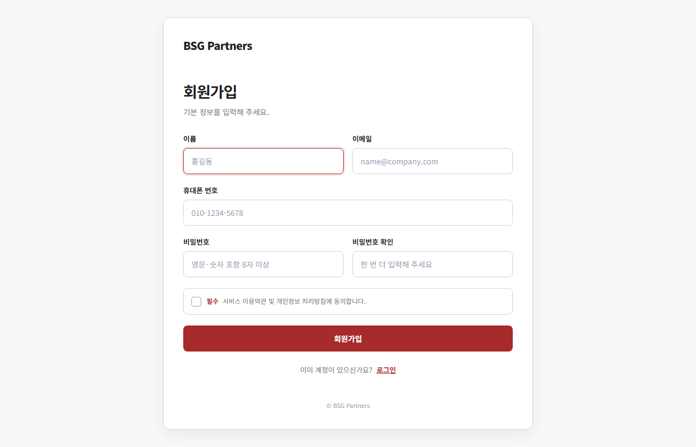
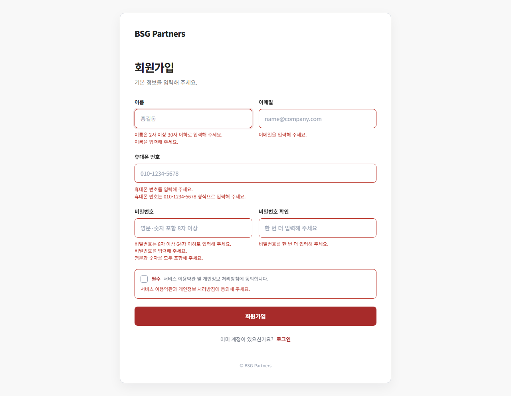
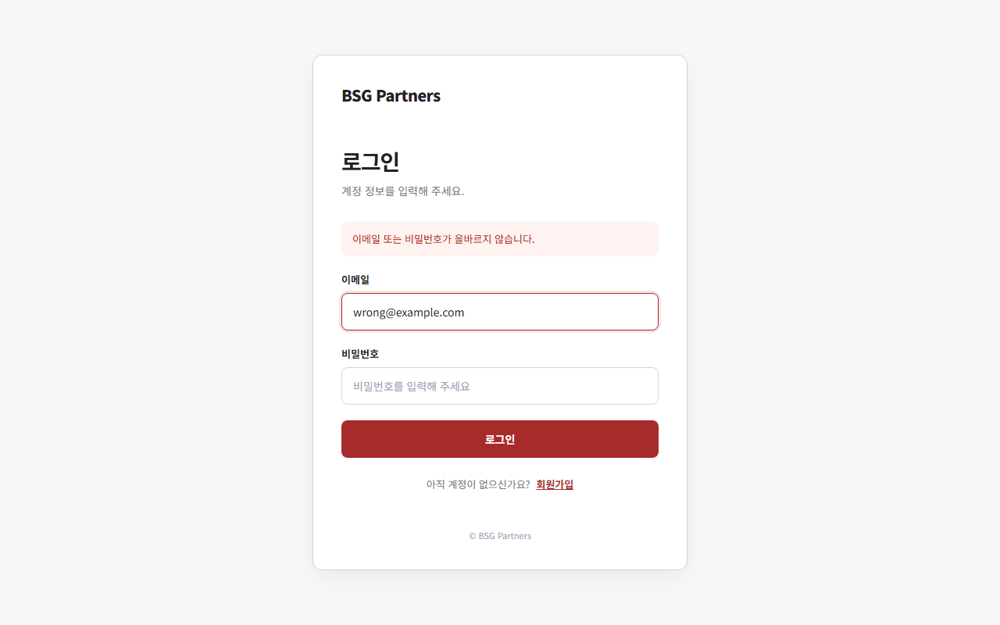
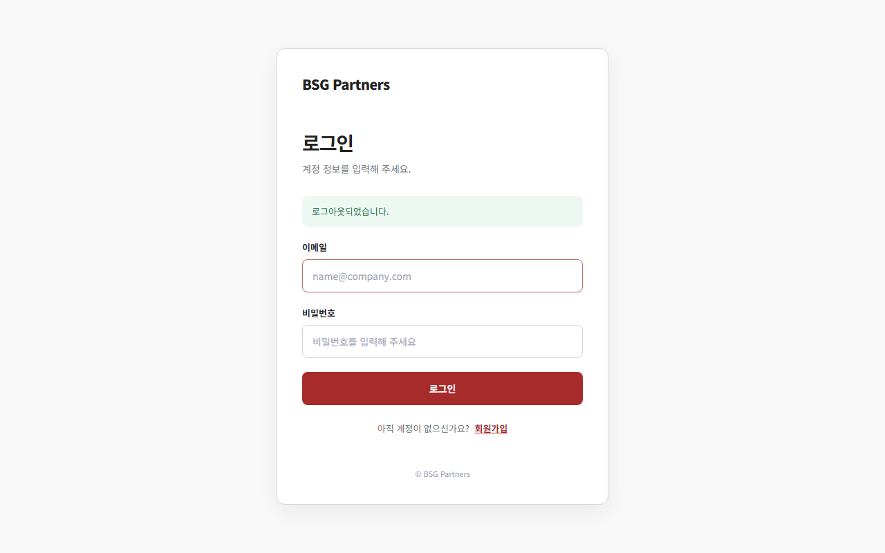
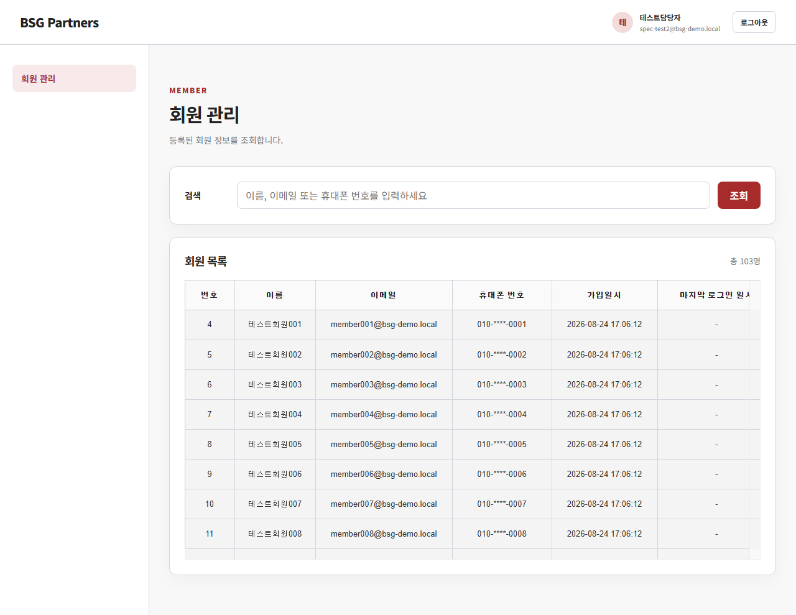
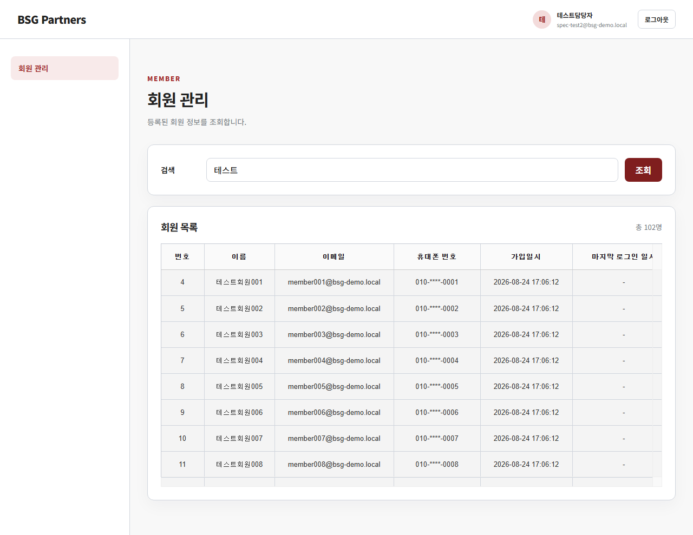
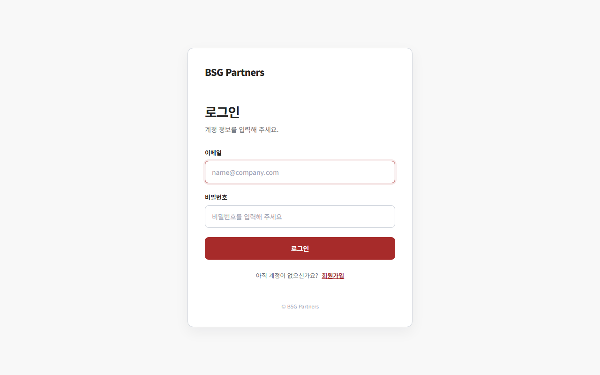

# AS-IS 시스템 설계 문서

> **문서 목적:** 내부 PI/PO 업무 인수인계를 위한 현재 시스템 업무 흐름 및 구조 설명  
> **표기 규칙:**
> - ✅ 확인됨 — 실제 구현 코드에서 직접 확인한 사실
> - 🔶 추정 — 구현을 근거로 판단했으나 담당자 확인 권장
> - ❓ 확인 필요

---

## Overview

**BSG Partners 회원관리 시스템**은 조직 내부 운영 담당자가 사용하는 웹 기반 회원 관리 도구다. Spring Boot 기반의 서버사이드 렌더링(SSR) 웹 애플리케이션으로, Thymeleaf 템플릿 엔진을 통해 화면을 제공하고 MySQL을 데이터 저장소로 사용한다.

담당자는 회원가입 후 로그인하여 전체 회원 목록을 조회하거나 키워드로 특정 회원을 검색할 수 있다. 외부 일반 이용자에게 공개되는 서비스가 아닌 **내부 운영 전용** 관리 화면으로 추정된다.

| 사용 대상 | 접근 가능 화면 |
|-----------|---------------|
| 미로그인 방문자 | 회원가입 화면, 로그인 화면 |
| 로그인 완료 담당자 | 회원 관리 화면(목록 조회/검색) |

**기술 스택 요약:**

| 항목 | 기술 |
|------|------|
| 백엔드 프레임워크 | Spring Boot (Java) |
| 템플릿 엔진 | Thymeleaf |
| 데이터베이스 | MySQL 8.4.10 |
| ORM/쿼리 매퍼 | MyBatis |
| 보안 | 직접 구현(Spring Security 미사용) — 인터셉터 + 세션 기반 인증 |
| 그리드 UI | TOAST UI Grid (CDN) |
| 실행 환경 | Docker Compose(MySQL) + Maven Wrapper(Spring Boot) |

---

## Architecture

시스템은 **계층형 아키텍처(Layered Architecture)**를 따르며, 각 계층은 인접 계층과만 통신한다. 업무 규칙(서비스 계층)은 특정 DB나 화면 기술에 의존하지 않아 이식성이 높다.

```
[브라우저 / 사용자]
        │  HTTP 요청 / Thymeleaf 응답
        ▼
┌─────────────────────────────────────────────────┐
│            Presentation Layer (Web Adapter)       │
│  AuthController     — 회원가입, 로그인, 로그아웃   │
│  HomeController     — 루트 경로, 회원 관리 화면    │
│  MemberQueryApiController — 회원 목록 JSON API    │
│                                                   │
│  CsrfTokenFilter    — CSRF 토큰 검증 필터          │
│  AuthenticationInterceptor — 인증 인터셉터         │
└─────────────────────────────────────────────────┘
        │
        ▼
┌─────────────────────────────────────────────────┐
│           Application Layer (Service)             │
│  AuthenticationService  — 회원가입, 로그인 처리    │
│  MemberQueryService     — 회원 조회 및 마스킹      │
└─────────────────────────────────────────────────┘
        │
        ▼
┌─────────────────────────────────────────────────┐
│          Data Access Layer (Repository)           │
│  MyBatisMemberRepository      — 회원 등록/조회/갱신│
│  MyBatisMemberQueryRepository — 회원 목록 검색    │
└─────────────────────────────────────────────────┘
        │
        ▼
┌─────────────────────────────────────────────────┐
│               Database (MySQL)                    │
│  members 테이블                                   │
└─────────────────────────────────────────────────┘
```

### 주요 업무 흐름

#### 2.1 신규 담당자 등록 흐름 (회원가입)

```
[회원가입 화면] "기본 정보를 입력해 주세요."
  │
  ├─ 이름 필드 입력 (placeholder: 홍길동) ─┐ 가로 2열
  ├─ 이메일 필드 입력 (placeholder: name@company.com) ─┘
  ├─ 휴대폰 번호 필드 입력 (placeholder: 010-1234-5678)
  │     └─ 숫자 입력 시 하이픈 자동 삽입 (예: 010-1234-5678)
  ├─ 비밀번호 필드 입력 (placeholder: 영문·숫자 포함 8자 이상) ─┐ 가로 2열
  ├─ 비밀번호 확인 필드 입력 (placeholder: 한 번 더 입력해 주세요) ─┘
  ├─ [필수] 서비스 이용약관 및 개인정보 처리방침 동의 체크박스 체크
  ├─ [회원가입] 버튼 클릭
  │
  ├─ 입력값 오류 → 오류가 있는 필드 바로 아래에 빨간 오류 메시지 표시, 화면 유지
  ├─ 이메일 중복 → 이메일 필드 아래 "이미 사용 중인 이메일" 오류 메시지, 화면 유지
  └─ 성공 → [로그인 화면]으로 이동, 상단 녹색 알림 "회원가입이 완료되었습니다." 표시
```

> **화면 캡처 — 회원가입 화면 (기본)**
>
> 

> **화면 캡처 — 회원가입 유효성 오류**
>
> 

#### 2.2 로그인 흐름

```
[로그인 화면] "계정 정보를 입력해 주세요."
  │
  ├─ (이미 로그인된 상태로 접근 시 → [회원 관리 화면]으로 자동 이동)
  │
  ├─ 이메일 필드 입력 (placeholder: name@company.com)
  ├─ 비밀번호 필드 입력 (placeholder: 비밀번호를 입력해 주세요)
  ├─ [로그인] 버튼 클릭
  │
  ├─ 입력값 형식 오류 → 해당 필드 아래 빨간 오류 메시지 표시, 화면 유지
  ├─ 이메일·비밀번호 불일치 → 폼 상단 빨간 알림 박스에 오류 메시지 표시, 화면 유지
  └─ 성공 → [회원 관리 화면]으로 이동
```

> **화면 캡처 — 로그인 화면 (기본)**
>
> 

> **화면 캡처 — 로그인 실패**
>
> 

> **화면 캡처 — 로그아웃 후 로그인 화면 (성공 알림)**
>
> 

#### 2.3 회원 목록 조회 흐름

```
[회원 관리 화면] "등록된 회원 정보를 조회합니다."
  │
  ├─ (미로그인 상태로 접근 시 → [로그인 화면]으로 자동 이동)
  │
  ├─ 화면 로드 시 전체 회원 목록 자동 표시 (총 N명)
  │     └─ 그리드 컬럼: 번호 / 이름 / 이메일 / 휴대폰 번호 / 가입일시 / 마지막 로그인 일시
  │         (휴대폰 번호는 010-****-XXXX 형식으로 표시)
  │
  ├─ 검색어 필드에 이름·이메일·휴대폰 번호 입력 후 [조회] 버튼 클릭 또는 Enter
  │     └─ 대소문자 구분 없이 검색, 결과 목록 및 총 인원 수 갱신
  │
  └─ 목록 조회 실패 시 총 인원 영역에 "목록을 불러오지 못했습니다." 표시
```

> **화면 캡처 — 회원 목록 화면 (전체 조회)**
>
> 

> **화면 캡처 — 회원 검색 결과**
>
> 

#### 2.4 로그아웃 흐름

```
[회원 관리 화면] 상단 헤더 우측
  │
  ├─ 로그인된 담당자 이름·이메일이 헤더에 표시된 상태
  ├─ [로그아웃] 버튼 클릭
  │
  └─ 성공 → [로그인 화면]으로 이동, 상단 녹색 알림 "로그아웃되었습니다." 표시
```

#### 2.5 세션 만료 흐름

```
[회원 관리 화면] 30분 이상 비활동 후 화면 조작 시
  │
  ├─ 검색 또는 목록 갱신 시도
  │
  └─ 서버가 인증 만료를 반환 → [로그인 화면]으로 자동 이동
```

> **화면 캡처 — 미인증 접근 시 로그인 화면으로 이동**
>
> 

---

## Components and Interfaces

### 화면 경로 (URL Endpoints)

| 화면 경로 | 이름 | 로그인 필요 | 설명 |
|-----------|------|------------|------|
| `/` | 루트 | - | 로그인 여부에 따라 /members 또는 /login으로 자동 이동 |
| `/signup` | 회원가입 | 불필요 | 신규 계정 등록 폼 |
| `/login` | 로그인 | 불필요 | 이메일·비밀번호 인증 |
| `/members` | 회원 관리 | 필요 | 회원 목록 조회 및 검색 |
| `/api/members` | 회원 조회 API | 필요 | 회원 목록 데이터 반환 (JSON) |
| `/logout` | 로그아웃 | 필요 | POST만 허용, 세션 종료 |
| 오류 화면 | 오류 안내 | - | 403·기타 오류 발생 시 표시 |

### 보안 컴포넌트 인터페이스

| 컴포넌트 | 역할 | 처리 방식 |
|---------|------|-----------|
| `CsrfTokenFilter` | 위조 요청 방지 | 모든 POST 요청에 세션 기반 CSRF 토큰 검증. 불일치 시 HTTP 403 |
| `AuthenticationInterceptor` | 인증 상태 확인 | 화면 경로 → 미인증 시 /login 이동, API 경로 → 미인증 시 HTTP 401 JSON 반환 |

### 주요 파일 위치

| 역할 | 경로 |
|------|------|
| 회원가입·로그인 처리 (Web) | `adapter/in/web/AuthController.java` |
| 회원가입·로그인 업무 규칙 | `application/service/AuthenticationService.java` |
| 회원 조회 업무 규칙 | `application/service/MemberQueryService.java` |
| DB 쿼리 (회원 등록/조회) | `resources/mapper/MemberMapper.xml` |
| DB 쿼리 (회원 검색) | `resources/mapper/MemberQueryMapper.xml` |
| CSRF 필터 | `adapter/in/web/security/CsrfTokenFilter.java` |
| 인증 인터셉터 | `adapter/in/web/security/AuthenticationInterceptor.java` |
| 화면 템플릿 | `resources/templates/` |

### 화면별 UI 구성 상세

#### 로그인 화면 (`/login`)


레이아웃: 단일 패널(`auth-panel`) 중앙 정렬

화면 구성 요소 (위에서 아래 순서):
1. `BSG Partners` 브랜드 링크 (홈으로 이동)
2. 타이틀: `로그인`
3. 소개 문구: `계정 정보를 입력해 주세요.`
4. **성공 메시지 영역** (녹색 알림): 회원가입 완료 또는 로그아웃 성공 후에만 표시
5. **전역 오류 메시지 영역** (빨간 알림 박스, 폼 상단): 이메일·비밀번호 불일치 시 표시
6. 입력 폼:
   - 이메일 필드 — 라벨 `이메일`, placeholder `name@company.com`
   - 비밀번호 필드 — 라벨 `비밀번호`, placeholder `비밀번호를 입력해 주세요`
   - 각 필드 아래 개별 오류 메시지 영역 (형식 오류 시 표시)
   - **[로그인]** 버튼
7. 전환 링크: `아직 계정이 없으신가요?` → 회원가입 화면
8. 푸터: `© BSG Partners`

#### 회원가입 화면 (`/signup`)


레이아웃: 단일 패널(`auth-panel`) 중앙 정렬

화면 구성 요소 (위에서 아래 순서):
1. `BSG Partners` 브랜드 링크
2. 타이틀: `회원가입`
3. 소개 문구: `기본 정보를 입력해 주세요.`
4. 입력 폼:
   - **이름 + 이메일** — 가로 2열 배치
     - 이름: placeholder `홍길동`, 자동 포커스
     - 이메일: placeholder `name@company.com`
   - **휴대폰 번호** — 전체 너비, placeholder `010-1234-5678`
     - 숫자 입력 시 `signup.js`가 하이픈을 자동 삽입 (예: `010-1234-5678`)
   - **비밀번호 + 비밀번호 확인** — 가로 2열 배치
     - 비밀번호: placeholder `영문·숫자 포함 8자 이상`
     - 비밀번호 확인: placeholder `한 번 더 입력해 주세요`
   - **약관 동의 체크박스** — 라벨 `[필수] 서비스 이용약관 및 개인정보 처리방침에 동의합니다.`
     - 각 필드·체크박스 바로 아래 빨간 오류 메시지 영역 (미입력·불일치·미동의 시 표시)
   - **[회원가입]** 버튼
5. 전환 링크: `이미 계정이 있으신가요?` → 로그인 화면
6. 푸터: `© BSG Partners`

#### 회원 관리 화면 (`/members`)


레이아웃: 상단 헤더 고정 + 좌측 사이드바 · 본문 2단 구성

**상단 헤더:**
- 좌측: `BSG Partners` 브랜드 링크
- 우측: 로그인된 담당자 정보 (이름 첫 글자 원형 아바타 + 이름 + 이메일) + **[로그아웃]** 버튼

**좌측 사이드바:**
- `회원 관리` 메뉴 링크 (현재 페이지 활성 표시, 단일 메뉴)

**본문 영역 (위에서 아래 순서):**
1. 페이지 헤더: 영문 라벨 `MEMBER` / 타이틀 `회원 관리` / 설명 `등록된 회원 정보를 조회합니다.`
2. **검색 카드:**
   - 검색어 입력 필드 — placeholder `이름, 이메일 또는 휴대폰 번호를 입력하세요`
   - **[조회]** 버튼 (클릭 또는 Enter로 검색 실행)
3. **회원 목록 카드:**
   - 헤딩 `회원 목록` + 총 인원 표시 (`총 N명`)
   - TOAST UI Grid (스크롤 지원, 창 너비에 따라 자동 레이아웃 갱신)

그리드 컬럼 구성:

| 컬럼 헤더 | 너비 | 비고 |
|-----------|------|------|
| 번호 | 80px | |
| 이름 | 최소 130px | |
| 이메일 | 최소 220px | |
| 휴대폰 번호 | 최소 160px | 중간 4자리 `****` 처리 |
| 가입일시 | 최소 170px | `YYYY-MM-DD HH:MM:SS` 형식 |
| 마지막 로그인 일시 | 최소 190px | 미로그인 시 `-` 표시 |

#### 오류 화면

> 오류 화면은 CSRF 토큰 불일치 등 403 상황에서 서버가 직접 렌더링합니다. 아래는 미인증 접근 시 로그인 화면으로 리다이렉트된 상태(가장 가까운 접근 차단 케이스)입니다.


레이아웃: 단일 카드(`error-card`) 중앙 정렬

화면 구성 요소 (위에서 아래 순서):
1. `BSG Partners` 브랜드 링크 (홈으로 이동)
2. HTTP 상태 코드 (예: `403`)
3. 고정 제목: `요청을 처리하지 못했습니다. 관리자 문의 : 02-6730-3200`
4. 상황별 안내 메시지:
   - 403: `[접근 거부] 요청이 만료되었습니다. 새로고침 후 다시 시도해 주세요.`
   - 그 외: `잠시 후 다시 시도해 주세요.`
5. **[처음으로]** 버튼 (홈으로 이동)

---

## Data Models

### 회원 정보 (`members` 테이블)

| 컬럼 | 타입 | 제약 | 설명 |
|------|------|------|------|
| `id` | BIGINT AUTO_INCREMENT | PK | 시스템 내부 식별 번호 |
| `email` | VARCHAR(255) | UNIQUE, NOT NULL | 로그인 ID. 소문자로 정규화하여 저장 |
| `password_hash` | CHAR(60) | NOT NULL | BCrypt 해시값. 원문 없음 |
| `name` | VARCHAR(30) | NOT NULL | 공백 제거 후 저장 |
| `phone_number` | VARCHAR(11) | NULL 허용 | 숫자 11자리 (하이픈 없음). 🔶 스키마상 NULL 허용이나 가입 폼에서 필수 입력 |
| `created_at` | DATETIME(6) | NOT NULL | 가입일시. Asia/Seoul 기준, 마이크로초 정밀도 |
| `last_login_at` | DATETIME(6) | NULL 허용 | 최근 로그인 일시. 미로그인 시 NULL |

> ✅ 확인됨: 회원 탈퇴, 계정 비활성화, 삭제 기능은 현재 없다.  
> 🔶 추정: `phone_number`가 NULL 허용으로 선언되어 있어 직접 DB 삽입 시 번호 없이 저장될 수 있다.

### 세션 데이터 (서버 메모리/저장소)

세션에는 다음 정보만 저장되며 비밀번호는 포함되지 않는다.

| 항목 | 설명 |
|------|------|
| 회원 ID | 시스템 내부 식별 번호 |
| 이메일 | 로그인 이메일 |
| 이름 | 화면 상단 표시용 |

**세션 설정:**
- 만료: 30분 비활동 후 자동 만료
- 쿠키: 세션 ID만 클라이언트에 저장
- 보안: `SESSION_COOKIE_SECURE=true` 설정 시 HTTPS 전용

### 데이터 처리 규칙 요약

| 번호 | 규칙 | 확인 상태 |
|------|------|-----------|
| BR-01 | 비밀번호는 BCrypt(강도 기본 12) 해시로만 저장하며 원문은 어디에도 보관하지 않는다 | ✅ |
| BR-02 | 이메일은 소문자로 정규화하여 저장하고 로그인 비교 시에도 소문자 변환 후 비교한다 | ✅ |
| BR-03 | 휴대폰 번호는 010으로 시작하는 11자리 한국 휴대폰만 허용하며 숫자만 저장한다 | ✅ |
| BR-04 | 휴대폰 번호는 조회 시 반드시 중간 4자리를 숨김 처리하여 표시한다 | ✅ |
| BR-05 | 모든 일시는 한국 표준시(Asia/Seoul, UTC+9) 기준으로 저장하고 표시한다 | ✅ |
| BR-06 | 로그인 성공 시 세션 ID를 새로 발급하여 세션 고정(Session Fixation) 공격을 방지한다 | ✅ |
| BR-07 | 세션은 30분 비활동 후 자동 만료되며, 쿠키 방식으로만 관리된다 | ✅ |
| BR-08 | 이메일은 시스템 전체에서 유일해야 하며 동일 이메일로 중복 가입 불가 | ✅ |
| BR-09 | 이름은 공백 제거 후 저장하고 2자 이상 30자 이하여야 한다 | ✅ |
| BR-10 | 비밀번호는 영문과 숫자를 반드시 포함하고 8자 이상 64자 이하여야 한다 | ✅ |

---

## Error Handling

### 인증 및 접근 오류

| 오류 상황 | 응답 방식 | 내용 |
|-----------|-----------|------|
| 미인증 사용자 → 화면 경로 접근 | HTTP 302 리다이렉트 | `/login` 화면으로 이동 |
| 미인증 사용자 → API 경로 접근 | HTTP 401 JSON | 한국어 오류 메시지 반환 |
| 세션 만료 후 API 호출 | HTTP 401 | 브라우저 JavaScript가 `/login`으로 자동 이동 |
| CSRF 토큰 불일치 | HTTP 403 오류 화면 | "[접근 거부] 요청이 만료되었습니다. 새로고침 후 다시 시도해 주세요." + 관리자 연락처(02-6730-3200) |
| 기타 서버 오류 | 오류 화면 | "잠시 후 다시 시도해 주세요." + 관리자 연락처(02-6730-3200) |

### 입력값 유효성 오류

| 오류 상황 | 응답 방식 | 내용 |
|-----------|-----------|------|
| 회원가입 입력값 검사 실패 | 동일 화면 유지 | 오류가 발생한 필드 바로 아래 빨간 오류 메시지 표시 |
| 이메일 중복 | 동일 화면 유지 | "이미 사용 중인 이메일" 오류 메시지 |
| 로그인 이메일/비밀번호 불일치 | 동일 화면 유지 | 폼 상단 빨간 알림 박스에 오류 메시지 표시 (어느 쪽이 틀렸는지 노출하지 않음) |

### 계정 보호 처리

- **타이밍 공격 방지:** 존재하지 않는 계정에 대해서도 동일한 BCrypt 더미 비교를 수행하여 응답 시간으로 계정 존재 여부를 추정할 수 없도록 처리한다. ✅

---

## Correctness Properties

*A property is a characteristic or behavior that should hold true across all valid executions of a system — essentially, a formal statement about what the system should do.*

### Property 1: 이름 유효성 검사

*For any* 문자열 입력에 대해, 공백 제거 후 길이가 2자 미만이거나 30자를 초과하는 경우 시스템은 해당 이름을 거부해야 하며, 2~30자 범위 내의 이름은 수락해야 한다.

**Validates: Requirements 1.1**

---

### Property 2: 이메일 소문자 정규화 멱등성

*For any* 유효한 이메일 문자열에 대해, 소문자 정규화 함수를 한 번 적용한 결과와 두 번 적용한 결과는 동일해야 한다 (멱등성). 즉, `normalize(normalize(email)) == normalize(email)`.

**Validates: Requirements 1.2, 2.5**

---

### Property 3: 이메일 중복 가입 방지

*For any* 유효한 이메일 주소에 대해, 해당 이메일로 한 번 가입이 완료된 후 동일 이메일(대소문자 무관)로 재가입을 시도하면 시스템은 오류를 반환해야 한다.

**Validates: Requirements 1.3**

---

### Property 4: 휴대폰 번호 정규화

*For any* 유효한 한국 휴대폰 번호 문자열(하이픈 포함 또는 미포함)에 대해, 정규화 후 저장되는 값은 항상 하이픈이 없는 11자리 숫자 문자열이어야 한다.

**Validates: Requirements 1.4, 1.5**

---

### Property 5: 비밀번호 유효성 검사

*For any* 문자열에 대해, 영문과 숫자를 모두 포함하고 길이가 8~64자인 경우에만 비밀번호로 수락되어야 하며, 그 외의 경우는 모두 거부되어야 한다.

**Validates: Requirements 1.6**

---

### Property 6: 세션 ID 교체 (세션 고정 공격 방지)

*For any* 유효한 인증 정보로 로그인 요청이 성공한 경우, 로그인 완료 후의 세션 ID는 로그인 이전의 세션 ID와 달라야 한다.

**Validates: Requirements 2.6**

---

### Property 7: 대소문자 무관 검색

*For any* 검색 키워드와 회원 데이터셋에 대해, 키워드를 대문자로 입력한 결과와 소문자로 입력한 결과는 항상 동일한 회원 목록을 반환해야 한다.

**Validates: Requirements 4.3**

---

### Property 8: 휴대폰 번호 마스킹

*For any* 유효한 11자리 휴대폰 번호에 대해, 마스킹 함수는 항상 `010-****-XXXX` 형식의 문자열을 반환해야 하며 원본 번호의 끝 4자리는 보존되어야 한다.

**Validates: Requirements 4.7**

---

### Property 9: 데모 데이터 시드 멱등성

*For any* 실행 횟수에 대해, 데모 데이터 시드 작업을 n번 실행한 결과와 1번 실행한 결과는 동일한 회원 데이터셋을 만들어야 한다 (idempotent).

**Validates: Requirements 7.2**

---

## Testing Strategy

이 문서는 AS-IS 분석 문서로, 기존 구현의 정확성을 검증하기 위한 테스트 전략을 제시한다.

### 단위 테스트 (Unit Tests)

업무 규칙 및 데이터 변환 로직을 대상으로 한다.

| 대상 | 검증 항목 | 예시 |
|------|-----------|------|
| 이름 유효성 검사기 | 2~30자 경계값, 공백 제거 | 1자/31자 → 거부, 2자/30자 → 수락 |
| 이메일 정규화 | 대소문자 → 소문자 변환, 멱등성 | `User@EXAMPLE.COM` → `user@example.com` |
| 휴대폰 번호 정규화 | 하이픈 제거, 11자리 저장 | `010-1234-5678` → `01012345678` |
| 비밀번호 유효성 검사기 | 영문+숫자 필수, 8~64자 | 숫자만/영문만/7자 → 거부 |
| 마스킹 함수 | 중간 4자리 `****` 치환 | `01012345678` → `010-****-5678` |

### 속성 기반 테스트 (Property-Based Tests)

각 Property에 대해 무작위 입력으로 100회 이상 반복 검증한다.

| Property | 생성기 | 검증 항목 |
|----------|--------|-----------|
| Property 2: 이메일 정규화 멱등성 | 임의 이메일 문자열 | `normalize(normalize(x)) == normalize(x)` |
| Property 4: 휴대폰 번호 정규화 | 유효한 전화번호 (하이픈 유무 랜덤) | 저장값이 항상 11자리 숫자 |
| Property 5: 비밀번호 유효성 | 임의 문자열 | 유효 조건 충족 여부와 결과 일치 |
| Property 7: 대소문자 무관 검색 | 임의 키워드, 임의 회원 데이터셋 | 대소문자 변형에 무관하게 동일 결과 |
| Property 8: 마스킹 | 유효한 11자리 번호 | 결과 패턴 `\d{3}-\*{4}-\d{4}` |
| Property 9: 시드 멱등성 | 실행 횟수 n (1~10) | n회 실행 후 회원 수가 항상 동일 |

### 통합 테스트 (Integration Tests)

외부 시스템(DB, 세션)과의 연동 및 전체 흐름을 검증한다.

| 흐름 | 검증 항목 |
|------|-----------|
| 회원가입 → 로그인 → 로그아웃 | 전체 인증 사이클 정상 동작 |
| 세션 만료 후 API 호출 | HTTP 401 반환 및 리다이렉트 |
| CSRF 토큰 없는 POST 요청 | HTTP 403 반환 |
| 중복 이메일 가입 시도 | 오류 메시지 표시 후 화면 유지 |
| 데모 데이터 시드 멱등성 | 여러 번 시드 실행 후 회원 수 변동 없음 |

### 현재 구현되지 않은 기능 (테스트 불필요 항목)

다음 기능은 현재 시스템에 없으므로 테스트 범위에서 제외한다:
- 회원 정보 수정
- 회원 삭제/비활성화
- 비밀번호 재설정
- 로그인 실패 잠금 정책
- 페이지네이션

---

## 외부 연결 및 인프라

| 구분 | 상세 | 확인 상태 |
|------|------|-----------|
| 데이터베이스 | MySQL 8.4.10 (Docker Compose로 실행) | ✅ |
| DB 이름 | `lx_auth` | ✅ |
| 그리드 UI 라이브러리 | TOAST UI Grid (인터넷 CDN에서 로딩) | ✅ |
| CSS 폰트 | 인터넷 CDN 의존 여부 확인 필요 | ❓ |
| 이메일 발송 | 현재 없음 (비밀번호 재설정, 가입 알림 등 없음) | ✅ |
| 외부 인증 연동 | 현재 없음 (소셜 로그인 등 없음) | ✅ |

> ✅ 확인됨: 회원 관리 화면의 그리드는 TOAST UI Grid CDN(`uicdn.toast.com`)을 브라우저에서 직접 내려받는다. 인터넷 연결이 없는 환경에서는 그리드가 표시되지 않는다.

---

## 운영 관련 조건

| 항목 | 내용 |
|------|------|
| 서버 실행 방법 | Docker Compose(MySQL) + Maven Wrapper(Spring Boot) |
| 기본 포트 | HTTP 8080 |
| 환경 설정 | `.env` 파일 또는 환경변수로 DB 접속 정보, 보안 설정 관리 |
| 타임존 | 서버 및 DB 모두 `Asia/Seoul` 기준 |
| 운영 필수 설정 | `SESSION_COOKIE_SECURE=true` (HTTPS 환경), `SEED_DEMO_MEMBERS=false` |
| Thymeleaf 캐시 | 운영 환경에서는 `THYMELEAF_CACHE=true` (기본값), 개발 시 `false` 권장 |
| DB 연결 풀 | 기본 최대 10개 연결 |

---

## 보안 처리 방식

*이 항목은 PI/PO가 검토할 보안 정책을 업무 언어로 설명한다.*

| 항목 | 적용 방식 |
|------|-----------|
| 비밀번호 보호 | BCrypt 암호화 (강도 12, 기본값). 원문 없음 |
| 로그인 유지 | 세션(Session) 방식. 브라우저 쿠키에 세션 ID만 저장 |
| 세션 만료 | 30분 비활동 후 자동 만료 |
| 세션 고정 공격 방지 | 로그인 성공 시 새 세션 ID 발급 |
| 위조 요청 방지(CSRF) | 모든 POST 요청에 숨겨진 검증 코드 포함 요구 |
| 미인증 접근 차단 | 화면 경로는 로그인 화면으로, API 경로는 HTTP 401로 응답 |
| 계정 존재 여부 보호 | 없는 계정도 동일한 처리 시간이 되도록 더미 비밀번호 비교 수행 |
| HTTPS 지원 | 환경변수 `SESSION_COOKIE_SECURE=true` 설정 시 HTTPS에서만 쿠키 전송 (기본값: 비활성) |

> ❓ 확인 필요: 로그인 실패 횟수 제한(잠금 정책)은 현재 구현되어 있지 않다.

---

## 문서와 실제 구현의 일치 확인

README.md와 실제 구현을 대조한 결과 주요 내용은 일치한다.

| 항목 | README 내용 | 실제 구현 | 일치 여부 |
|------|------------|-----------|-----------|
| 회원가입 항목 | 이름, 이메일, 휴대폰 번호, 비밀번호, 약관 동의 | 동일 | ✅ |
| 비밀번호 BCrypt | cost 12 기본값 | `BCryptPasswordHasher.java` 확인 | ✅ |
| 세션 만료 | 30분 | `application.yml` 확인 | ✅ |
| 휴대폰 번호 마스킹 형식 | `010-****-5678` | `MemberQueryService.java` 확인 | ✅ |
| 데모 회원 100명 | member001~100 | `member-seed-true.sql` 확인 | ✅ |
| 타임존 | Asia/Seoul | `ApplicationConfiguration.java` 확인 | ✅ |
| CSRF 보호 | 세션 기반 | `CsrfTokenFilter.java` 확인 | ✅ |

> ✅ README와 구현 간 불일치 사항 없음. README가 구현을 정확히 반영하고 있다.
