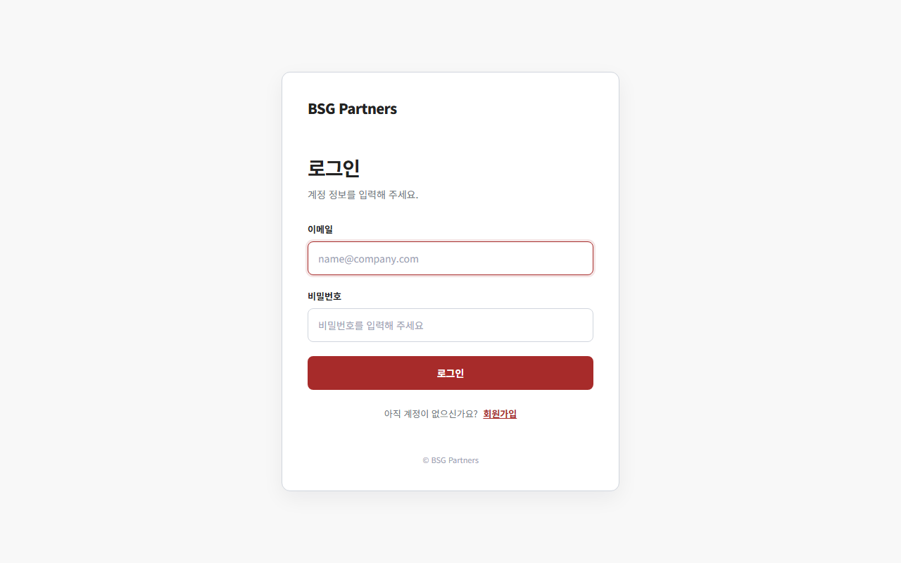

# Kiro BSG 회원관리

## 주요 기능

- 이름, 이메일, 한국 휴대폰 번호, 비밀번호와 약관 동의를 검증하는 회원가입
- 이메일 정규화, BCrypt 비밀번호 검증과 세션 기반 로그인·로그아웃
- 로그인 성공 시 세션 ID 교체, 최근 로그인 일시 갱신과 `/members` 이동
- 이름·이메일·휴대폰 번호를 대상으로 하는 회원 목록 검색
- TOAST UI Grid 기반 회원관리 화면과 반응형 레이아웃
- 휴대폰 번호 숫자 저장 및 `010-****-5678` 형식의 조회 마스킹
- 가입일시·최근 로그인 일시의 `Asia/Seoul` 기준 처리
- 조회 화면 확인용 데모 회원 100명 멱등성 보장하며 초기화 진행
- **문의 요청**: 로그인한 사용자의 문의 작성·목록·상세 조회, 최신순 10건 단위 페이지네이션과 조회수 표시
- **권한 관리(ADMIN 전용)**: 역할(`ADMIN`/`OPERATOR`/`VIEWER`)·계정 상태(`ACTIVE`/`SUSPENDED`) 변경, 서버 사이드 페이지네이션·필터·검색, 변경 사유 입력과 확인 UI, 낙관적 잠금 충돌 감지
- **권한 변경 감사 로그**: 모든 역할/상태 변경을 변경과 동일 트랜잭션으로 기록하고 최신순 페이지네이션으로 조회

## 권한 관리(Access Management)

로그인 후 좌측 사이드바는 다음 메뉴로 구성됩니다. 일반 사용자는 문의 요청만,
`ADMIN` 사용자는 회원 관리·권한 관리까지 총 세 개의 메뉴를 확인할 수 있습니다.

1. **회원 관리** — `ADMIN` 역할에게만 표시 (`/members`)
2. **문의 요청** — 모든 로그인 사용자에게 표시 (`/inquiries`)
3. **권한 관리** — `ADMIN` 역할에게만 표시 (`/admin/access`)

### 역할과 계정 상태

| 구분 | 값 | 설명 |
| --- | --- | --- |
| 역할 | `ADMIN` | 모든 회원의 역할과 상태를 변경할 수 있음 |
| 역할 | `OPERATOR` | 권한 관리 메뉴/ API 사용 불가 |
| 역할 | `VIEWER` | 신규 가입 기본값, 권한 관리 메뉴/ API 사용 불가 |
| 상태 | `ACTIVE` | 정상 로그인 가능 |
| 상태 | `SUSPENDED` | 로그인 불가, 기존 세션도 다음 요청에서 차단 후 무효화 |

### 정책

- 신규 가입자는 기본적으로 `VIEWER`, `ACTIVE` 로 등록됩니다.
- 현재 로그인한 관리자는 자기 자신의 역할을 낮추거나 계정을 정지할 수 없습니다.
- 시스템에는 활성 상태의 `ADMIN` 이 최소 1명 이상 남아 있어야 합니다.
- 동시에 두 관리자가 같은 회원을 변경하면 `version` 으로 충돌을 감지해 HTTP 409 를 반환합니다.
- 모든 규칙은 클라이언트가 아닌 서버에서 다시 검증하며, 휴대폰 번호 등 개인정보는 조회 시 마스킹합니다.
- 모든 역할/상태 변경은 감사 로그(대상/수행자/변경 전후/사유/일시/요청 IP)로 기록되며 변경과 동일 트랜잭션에서 저장됩니다.

### 초기 관리자 지정

신규 가입자는 모두 `VIEWER` 이므로, 운영 환경에서는 `BOOTSTRAP_ADMIN_EMAIL` 환경변수로 초기 관리자를
지정합니다. 애플리케이션 시작 시 해당 이메일의 회원을 `ADMIN`/`ACTIVE` 로 승격합니다(멱등적이며, 회원이
없으면 경고만 남기고 건너뜁니다).

```powershell
$env:BOOTSTRAP_ADMIN_EMAIL = "admin@your-company.com"
```

데모 환경(`SEED_DEMO_MEMBERS=true`)에서는 `member001@bsg-demo.local` 이 `ADMIN`,
`member002@bsg-demo.local` 이 `OPERATOR` 로 지정되어 권한 관리 화면을 즉시 확인할 수 있습니다.

## 문의 요청(Inquiry)

로그인한 사용자가 문의를 등록하고 전체 문의 목록·상세·검증된 첨부를 확인하는 기능입니다. 회원관리와 공통 사이드바·스타일을 사용하며, 문의 목록은 TOAST UI Grid 없이 HTML 테이블로 표시합니다.

### 화면과 사용 흐름

| 화면 | 주요 기능 |
| --- | --- |
| 문의 목록 | 번호·제목·조회수·작성일과 전체 건수 표시, 최신순 정렬, 페이지당 10건 조회 |
| 문의 작성 | 목록의 **문의 작성** 버튼으로 이동, 제목·내용과 선택 첨부를 입력 후 **등록** |
| 문의 상세 | 작성자·제목·전체 내용·작성일시·조회수·첨부 다운로드를 확인. 작성자에게만 **수정** 진입을 표시 |
| 문의 수정 | 작성자만 `GET /inquiries/{id}/edit`로 접근. 제목·내용을 고치고 기존 첨부를 보존, 새 파일 추가, 또는 선택 파일 삭제 후 multipart `POST /inquiries/{id}/edit`로 저장 |

등록 또는 수정에 성공하면 해당 문의의 상세 화면으로 이동합니다. 수정 중 기존 첨부는 `deleteAttachmentIds`로 명시 선택한 경우에만 삭제되며, 신규 첨부나 삭제 선택 없이 본문만 수정할 수도 있습니다.

### 입력·첨부 검증

| 항목 | 조건 | 서버 검증 |
| --- | --- | --- |
| 제목 | 필수, 공백만 입력 불가, 최대 20자 | `@NotBlank`·`@Size` |
| 내용 | 필수, 공백만 입력 불가, 최대 500자 | `@NotBlank`·`@Size` |
| 허용 형식 | PDF, PNG, JPEG | 확장자·선언 MIME·파일 서명이 모두 일치해야 함 |
| 신규 파일 1개 | 최대 10 MiB | multipart 설정과 서버 validator |
| 최종 첨부 세트 | 최대 5개, 보존 파일을 포함해 최대 20 MiB | 삭제 선택 후 남는 파일과 새 파일을 서버에서 합산 |

HTML 파일 선택의 `accept` 및 브라우저 표시 용량은 편의 기능일 뿐, 허용 형식·권한·개수·크기 검증을 대체하지 않습니다. 첨부 안내 문구와 기존 파일 목록에만 12px 글자 크기가 적용되며 다른 문의 화면 글자 크기는 바꾸지 않습니다.

### 접근·저장 정책

- 목록·상세·다운로드·작성은 로그인한 활성 계정이 사용할 수 있으며, ADMIN 전용 기능이 아닙니다.
- 본인이 작성한 문의뿐 아니라 다른 사용자가 작성한 문의도 조회·다운로드할 수 있지만, 편집과 첨부 삭제는 작성자 본인만 가능합니다. 비작성자는 HTTP 403으로 처리되며 파일 또는 문의는 변경되지 않습니다.
- 생성·수정 POST에는 세션 기반 CSRF 토큰이 필요합니다. 미인증 `/inquiries/**` 요청은 로그인 화면으로 이동합니다.
- 첨부파일은 웹 공개 경로 밖의 `INQUIRY_ATTACHMENT_STORAGE_PATH`에 UUID 저장 키로 보관됩니다. 신규 파일의 저장 또는 DB 반영 실패 시 새 파일을 보상 삭제합니다. 선택 삭제한 기존 파일은 DB 커밋 후 제거하며 제거 실패는 운영 재조정 로그 대상으로 남깁니다.
- `inquiry_attachments`는 첨부별 metadata를 유지하는 기존 스키마를 그대로 사용합니다. 최종 5개·20 MiB는 행별 DB 제약이 아니라 서비스의 aggregate invariant이므로 edit 전용 Liquibase changeSet은 없습니다. 기존 metadata, UUID 저장 키 및 다운로드는 호환됩니다.
- 문의는 작성일시 내림차순, 같은 시각에는 ID 내림차순으로 정렬합니다. 페이지 번호는 기본값 1이며 범위를 벗어나면 첫/마지막 페이지로 보정합니다. 조회수는 상세 접근마다 1 증가합니다.

### 검증 상태

문의 편집의 9.7.8(단위·속성 기반) 및 9.7.9(controller·integration·migration 회귀) 검증 작업은 사용자 요청으로 **건너뛰었습니다**. 이 문서 갱신에서는 테스트·빌드·마이그레이션을 실행하지 않았으므로, 해당 확장의 자동 검증 또는 빌드 통과를 주장하지 않습니다.

## 주요 화면

| 로그인 | 회원가입 |
| --- | --- |
|  |  |


## 기술 스택

| 구분 | 기술 |
| --- | --- |
| Language | Java 17 |
| Framework | Spring Boot 3.0.5, Spring MVC |
| View | Thymeleaf, HTML5, CSS3, Vanilla JavaScript |
| Grid | TOAST UI Grid `latest` CDN |
| Validation | Jakarta Bean Validation |
| Persistence | MyBatis Spring Boot 3.0.1 |
| Database | MySQL 8.4.10 |
| Test | JUnit 5, AssertJ, H2 MySQL compatibility mode |
| Security | BCrypt, Session Authentication, CSRF |
| Build | Maven Wrapper 3.9.11 |
| Infrastructure | Docker Compose |

## 구조

```text
com.lxpantos.auth
├─ domain/member                 순수 도메인 모델
├─ domain/inquiry                문의 도메인 모델
├─ application
│  ├─ port/in                   회원가입·로그인·회원조회·문의 작성/조회 유스케이스
│  ├─ port/out                  회원·문의 저장/조회 및 암호화 포트
│  └─ service                   인증·회원조회·문의 애플리케이션 서비스
├─ adapter
│  ├─ in/web                    MVC/API, 폼, 세션, 인증, CSRF
│  └─ out                       MyBatis 쓰기·조회 저장소, BCrypt
└─ config                       의존성 조립, MVC 설정
```

## 실행

### 사전 준비

- JDK 17 이상
- Docker Engine 또는 Docker Desktop
- Docker Compose

MySQL은 Docker Compose로 실행하고 애플리케이션은 Maven Wrapper로 실행합니다.

1. 환경 파일을 준비합니다.

   ```powershell
   Copy-Item .env.example .env
   ```

   테스트 DB의 기본 애플리케이션 계정은 `lx_app / lx_app_password`입니다.
   `MYSQL_ROOT_PASSWORD`는 로컬 환경에 맞는 값으로 변경하고 `.env`는 Git에 추가하지 않습니다.

2. Docker daemon을 구동한 뒤 MySQL을 실행합니다.

   ```powershell
   docker compose up -d
   docker compose ps
   ```

3. Spring Boot가 사용할 DB 접속 정보를 현재 PowerShell 세션에 설정합니다.

   `.env`는 Docker Compose가 자동으로 읽지만, Maven으로 직접 실행한 Spring Boot는 자동으로
   읽지 않습니다. 테스트 DB의 `DB_USERNAME`, `DB_PASSWORD` 기본값은 각각 `lx_app`,
   `lx_app_password`이며 `.env`의 `MYSQL_USER`, `MYSQL_PASSWORD`와 일치합니다.

   ```powershell
   $env:DB_URL = "jdbc:mysql://localhost:3306/lx_auth?useUnicode=true&characterEncoding=UTF-8&serverTimezone=Asia/Seoul&connectionTimeZone=Asia/Seoul&forceConnectionTimeZoneToSession=true"
   $env:DB_USERNAME = "lx_app"
   $env:DB_PASSWORD = "lx_app_password"
   ```

4. 프로젝트 루트에서 애플리케이션을 실행합니다.

   ```powershell
   .\mvnw.cmd spring-boot:run
   ```

5. `http://localhost:8080/signup`에서 가입 후 로그인합니다. 로그인 성공 후 `/inquiries` 문의 요청
   화면으로 이동합니다. 회원관리 화면(`/members`)은 `ADMIN` 역할만 접근할 수 있습니다.

회원관리 그리드는 CDN에서 TOAST UI Grid를 내려받으므로 브라우저에서 인터넷에 접근할 수 있어야
합니다.

종료 후 MySQL 컨테이너만 내리려면 다음 명령을 사용합니다. 데이터 볼륨은 유지됩니다.

```powershell
docker compose down
```

## 주요 경로

| Method | 경로 | 인증 | 설명 |
| --- | --- | --- | --- |
| GET | `/` | 선택 | 로그인 상태에 따라 `/inquiries` 또는 `/login`으로 이동 |
| GET, POST | `/signup` | 불필요 | 회원가입 화면과 가입 처리 |
| GET, POST | `/login` | 불필요 | 로그인 화면과 인증 처리 |
| POST | `/logout` | 필요 | 세션 무효화 후 로그인 화면으로 이동 |
| GET | `/members` | ADMIN | 회원 목록·검색 화면(비관리자 403) |
| GET | `/api/members?keyword=` | ADMIN | 회원 전체 조회 또는 이름·이메일·휴대폰 번호 검색(비관리자 403 JSON) |
| GET | `/inquiries?page=1` | 필요 | 문의 목록(최신순, 페이지당 10건) |
| GET | `/inquiries/new` | 필요 | 신규 문의 작성 화면 |
| POST | `/inquiries` | 필요 | multipart 문의 등록(제목·내용·선택 첨부, CSRF 필요) |
| GET | `/inquiries/{id}` | 필요 | 문의 상세 조회 및 조회수 증가, 미존재 시 404 |
| GET | `/inquiries/{id}/edit` | 필요, 작성자 | 기존 첨부를 포함한 문의 편집 폼 |
| POST | `/inquiries/{id}/edit` | 필요, 작성자 | multipart 제목·내용 수정, 새 첨부 추가, `deleteAttachmentIds` 개별 삭제(CSRF 필요) |
| GET | `/admin/access` | ADMIN | 권한 관리 화면 |
| GET | `/api/admin/members` | ADMIN | 권한 관리 대상 회원 목록(검색·역할/상태 필터·페이지네이션) |
| PUT | `/api/admin/members/{id}/access` | ADMIN | 회원 역할/상태 변경(감사 로그 기록, CSRF 필요) |
| GET | `/api/admin/members/{id}/audit-logs` | ADMIN | 회원 권한 변경 감사 로그 조회(최신순 페이지네이션) |

미인증 화면 요청은 `/login`으로 이동하고 미인증 `/api/**` 요청은 HTTP 401과 한국어 JSON
메시지를 반환합니다. 관리자 화면(`/admin/**`)과 회원 관리 화면(`/members`)에 비관리자가 접근하면
HTTP 403, 관리자 API(`/api/admin/**`)와 회원 목록 API(`/api/members`)는 미인증 HTTP 401·권한 부족
HTTP 403 을 반환합니다.

### 관리자 API 오류 응답

관리자 API 오류는 `{"status": <숫자>, "message": "<한국어 메시지>"}` 형식으로 일관되게 반환합니다.

| 상황 | 상태 |
| --- | --- |
| 미인증 | 401 |
| 권한 부족 | 403 |
| 입력값 오류(사유 길이, 필수값 등) | 400 |
| 동시 수정 충돌(version 불일치) | 409 |
| 존재하지 않는 회원 | 404 |
| 예상하지 못한 오류 | 500 |

## 인증 및 세션 정책

- 비밀번호는 BCrypt(기본 cost 12) 해시만 DB에 저장합니다.
- 로그인 성공 시 세션 ID를 교체해 session fixation을 방지합니다.
- 세션에는 회원 ID, 이메일, 이름만 저장하고 30분 후 만료합니다.
- 세션 쿠키는 `HttpOnly`, `SameSite=Lax`, cookie-only tracking을 사용합니다.
- **운영** HTTPS 환경에서는 `SESSION_COOKIE_SECURE=true`를 반드시 설정합니다.
- 모든 상태 변경 POST 요청은 세션 기반 CSRF 토큰으로 검증합니다.
- 로그아웃은 POST만 허용하고 서버 세션을 즉시 무효화합니다.

## DB

앱 시작 시 Liquibase가 [`db/changelog`](src/main/resources/db/changelog)의 변경 이력을
순서대로 실행합니다. 기존 `members` 테이블과 컬럼은 precondition으로 감지해 유지하면서
누락된 변경만 적용하고, 신규 DB에는 전체 스키마를 생성합니다.
문의 테이블(`inquiries`)도 같은 `db.changelog-master.yaml`에서 관리하며,
기존 문의 테이블과 데이터는 유지합니다. 이후 스키마 변경은 기존 changeSet을 수정하지 않고
새 changeSet을 추가합니다. `spring.sql.init`은 데모 seed 데이터만 실행합니다.

- 휴대폰 번호는 하이픈을 제거해 저장하고 회원관리 API에서는 `010-****-5678` 형식으로 마스킹합니다.
- 가입일시와 마지막 로그인 일시는 `Asia/Seoul` 기준으로 저장합니다.

### 권한 관리 스키마 확장

기존 데이터를 삭제·초기화하지 않고 추적되는 changeSet에서 다음 컬럼을 한 번만 추가합니다.
기존 회원은 기본값(`VIEWER`, `ACTIVE`, `version=0`)으로 채워집니다.

- `members.role VARCHAR(20) NOT NULL DEFAULT 'VIEWER'`
- `members.status VARCHAR(20) NOT NULL DEFAULT 'ACTIVE'`
- `members.version BIGINT NOT NULL DEFAULT 0` (낙관적 잠금)
- `members.role_updated_at DATETIME(6) NULL` (권한 최종 변경 일시)

또한 권한 변경 감사 로그 테이블 `member_access_audit_log` 를 생성합니다(대상/수행자 회원 ID,
변경 전후 역할·상태, 사유, 요청 IP, 변경 일시).

### 문의 요청 스키마

Liquibase의 `8-create-inquiries` changeSet이 `inquiries` 테이블을 생성합니다.
이미 테이블이 있으면 생성을 건너뛰어 기존 문의 데이터를 유지합니다.

| 컬럼 | 타입 | 용도 |
| --- | --- | --- |
| `id` | `BIGINT` | 자동 증가 문의 ID, 기본키 |
| `member_id` | `BIGINT` | 작성자 회원 ID, `members(id)` 외래키 |
| `title` | `VARCHAR(20)` | 문의 제목 |
| `content` | `TEXT` | 문의 내용, 입력 검증에서 최대 500자로 제한 |
| `view_count` | `BIGINT` | 조회수, 기본값 0 |
| `created_at` | `DATETIME(6)` | 작성일시 |

모든 컬럼은 필수값이며, 상세 조회 시 작성자 이름은 `members` 테이블과 조인하여 가져옵니다.

### 초기 회원 데이터

[`member-seed-true.sql`](src/main/resources/db/seed/member-seed-true.sql)은 애플리케이션 초기화 시
`member001@bsg-demo.local`부터 `member100@bsg-demo.local`까지 회원 100명을 중복 없이 추가합니다.
초기 회원은 원문을 보관하지 않은 무작위 BCrypt 해시를 사용하므로 로그인용 계정이 아니라
회원관리 화면 조회용 데이터입니다.

운영 환경에서는 `SEED_DEMO_MEMBERS=false`로 설정해 초기 회원 생성을 비활성화합니다.

## 환경변수

| 변수 | 기본값/예시 | 용도 |
| --- | --- | --- |
| `MYSQL_ROOT_PASSWORD` | 직접 지정 | Docker MySQL 관리자 비밀번호 |
| `MYSQL_DATABASE` | `lx_auth` | Docker MySQL 데이터베이스 |
| `MYSQL_USER` | `lx_app` | Docker MySQL 애플리케이션 계정 |
| `MYSQL_PASSWORD` | `lx_app_password` | Docker 테스트 DB 애플리케이션 비밀번호 |
| `MYSQL_PORT` | `3306` | 호스트 MySQL 포트 |
| `DB_URL` | 로컬 `lx_auth` JDBC URL | Spring Boot DB 접속 URL |
| `DB_USERNAME` | `lx_app` | Spring Boot DB 계정 |
| `DB_PASSWORD` | `lx_app_password` | Spring Boot 테스트 DB 비밀번호 |
| `DB_POOL_SIZE` | `10` | Hikari 최대 커넥션 수 |
| `SERVER_PORT` | `8080` | 애플리케이션 HTTP 포트 |
| `SESSION_COOKIE_SECURE` | `false` | HTTPS에서만 세션 쿠키 전송 |
| `BCRYPT_STRENGTH` | `12` | BCrypt cost |
| `THYMELEAF_CACHE` | `true` | Thymeleaf 템플릿 캐시 |
| `SEED_DEMO_MEMBERS` | `true` | 데모 회원 초기화 여부 |
| `BOOTSTRAP_ADMIN_EMAIL` | (빈 값) | 앱 시작 시 해당 이메일 회원을 `ADMIN`/`ACTIVE` 로 승격(초기 관리자 지정) |

## 테스트

```powershell
.\mvnw.cmd test
```

테스트는 다음 기준선을 검증합니다.

- H2 MySQL 호환 모드에서 Spring Context와 MyBatis 어댑터 조립
- 데모 회원 100명 초기화
- 로그인 성공 후 회원관리 화면 리다이렉트
- 인증·미인증 사용자의 루트 경로 처리
- 한국 휴대폰 번호 폼 검증과 저장 정규화
- 회원가입 및 최근 로그인 시각의 한국 시간대 처리
- 회원 조회 응답의 휴대폰 번호 마스킹
- 역할/상태 기본값(신규 가입 `VIEWER`/`ACTIVE`)
- 관리자 API 접근 제어: 미인증 401, `OPERATOR`/`VIEWER` 403, `ADMIN` 성공
- 역할/상태 변경 성공, 사유 누락·오류 시 400, 자기 강등/정지 거부, 마지막 활성 관리자 보호
- 낙관적 잠금 충돌 시 409, 존재하지 않는 회원 404, CSRF 미포함 시 403
- 정지 회원 로그인 거부 및 로그인 후 정지된 회원의 기존 세션 차단
- 권한 변경과 감사 로그의 트랜잭션 원자성, 감사 로그 최신순 조회와 IP 마스킹
- 검색·역할 필터·상태 필터·페이지네이션
- 초기 관리자(`BOOTSTRAP_ADMIN_EMAIL`) 승격 정책

### 문의 요청 테스트

문의 관련 테스트만 실행하려면 다음 명령을 사용합니다.

```powershell
.\mvnw.cmd "-Dtest=InquiryFormTest,InquiryServiceTest,InquiryControllerTest,InquirySchemaMigrationTest" test
```

| 테스트 | 검증 항목 |
| --- | --- |
| `InquiryFormTest` | 정상 입력, 제목·내용 공백 거부, 20자·500자 초과 거부 및 경계값 허용 |
| `InquiryServiceTest` | 작성자·제목·내용·초기 조회수·작성일시 저장 값 |
| `InquiryControllerTest` | 목록·작성·상세 화면 반환 및 존재하지 않는 문의의 404 처리 |
| `InquirySchemaMigrationTest` | 문의 테이블 신규 생성, 마이그레이션 재실행, 기존 테이블의 데이터 보존 |

## Kiro 프로젝트 파일

Kiro가 프로젝트의 목적과 구현 원칙을 일관되게 이해하고, 현재 시스템을 PI/PO 업무
인수인계 자료로 활용할 수 있도록 다음 문서를 관리합니다.

### Steering

- [`product.md`](.kiro/steering/product.md): 제품 목적, 핵심 기능, 사용자 흐름과 비즈니스 규칙
- [`structure.md`](.kiro/steering/structure.md): 헥사고날 아키텍처, 패키지·리소스 구조와 의존성 규칙
- [`tech.md`](.kiro/steering/tech.md): 기술 스택, 데이터베이스, 환경변수와 코드 컨벤션

### Spec

Spec 폴더는 `<도메인>-<대상/기능>` kebab-case 명명 규칙을 따른다(상세: [`structure.md`](.kiro/steering/structure.md) "Spec 네이밍 및 구조 컨벤션").

- [`member-auth-baseline`](.kiro/specs/member-auth-baseline/): 권한 구분 이전 초기 시스템(회원가입·로그인·회원 조회) 스냅샷 + 화면 캡처(`screenshots/`)
- [`member-access-management`](.kiro/specs/member-access-management/): 역할·상태·권한 관리·감사 로그
- [`inquiry-management`](.kiro/specs/inquiry-management/): 문의 작성·목록·상세(조회수)

### 문의 첨부파일 운영

문의 생성과 작성자 편집에서 PDF·PNG·JPEG 파일을 사용할 수 있습니다. 각 새 파일은 최대 10 MiB이며, 삭제 선택 후 보존되는 파일을 포함한 최종 첨부 세트는 최대 5개·20 MiB입니다. 서버가 확장자·선언 MIME·파일 서명을 모두 확인하며, 브라우저의 `accept` 선택지는 보조 UX일 뿐입니다. 첨부파일은 웹 공개 경로가 아닌 `INQUIRY_ATTACHMENT_STORAGE_PATH`의 전용 절대 경로에 UUID 저장 키로 보관되고, 로그인한 사용자는 문의 상세의 다운로드 링크로 받을 수 있습니다.

편집은 `GET /inquiries/{id}/edit` 및 CSRF 보호 multipart `POST /inquiries/{id}/edit`를 사용합니다. 작성자 본인만 편집할 수 있고, 기존 첨부는 `deleteAttachmentIds`로 명시한 파일만 삭제됩니다. 새 파일 저장 또는 DB 반영이 실패하면 새 파일을 보상 삭제하며, 선택 삭제된 기존 파일은 DB 커밋 후 제거합니다. 후속 파일 제거가 실패하면 내부 경로를 노출하지 않고 orphan reconciliation 로그로 남깁니다.

운영 전 해당 경로를 애플리케이션 계정 전용 읽기·쓰기 권한의 백업 대상 볼륨으로 준비해야 합니다. 경로를 비우면 애플리케이션이 시작하지 않습니다. 비정상 종료로 남은 파일은 `INQUIRY_ATTACHMENT_CLEANUP_ON_STARTUP=true` 설정 시 시작 단계에서 24시간이 지난 DB 비참조 UUID 파일만 정리합니다. 이 자동 정리는 기본적으로 꺼져 있으므로, 백업·보존 정책을 확인한 뒤 사용합니다.

> **검증 고지:** 문의 편집의 9.7.8 및 9.7.9 테스트 작업은 사용자 요청으로 건너뛰었으며, 이 문서 갱신에서는 테스트·빌드·마이그레이션을 실행하지 않았습니다.
